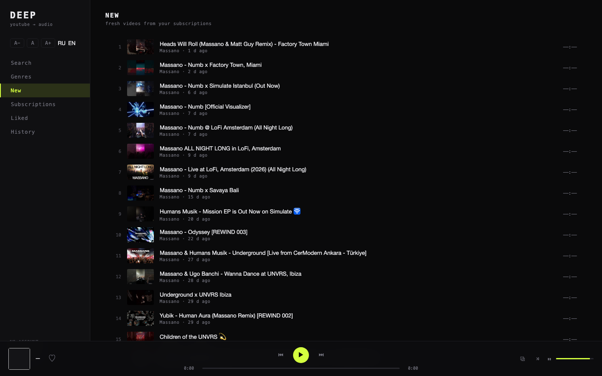
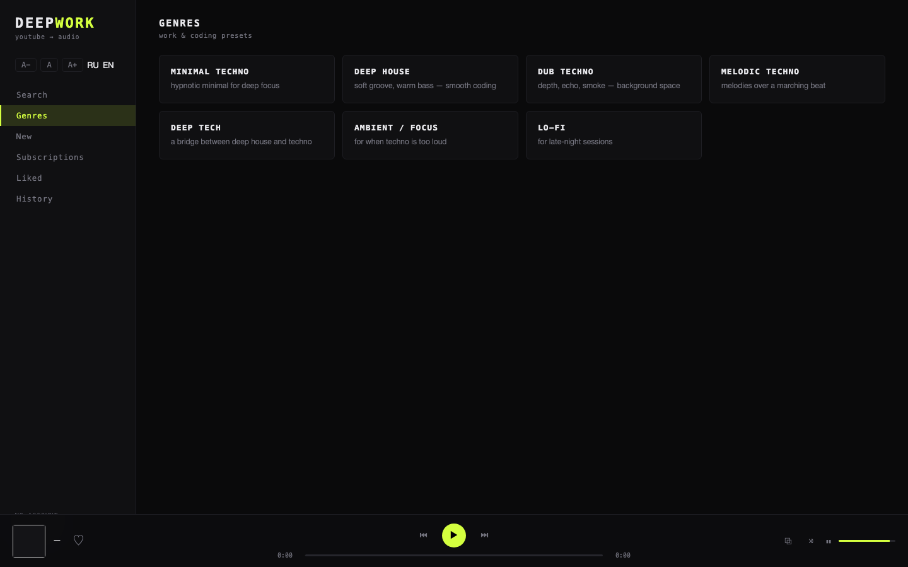

# deepwork — youtube → audio

English · [Русский](README.md)

A local audio player for YouTube: no account, no downloads — just the live audio track.
Built for work & coding music: minimal techno, deep house.




## Quick start

```bash
brew install yt-dlp        # the only external dependency
node server.js             # → http://localhost:8787
```

Requires Node ≥ 22.5 (built-in `node:sqlite`). Zero npm dependencies. UI and docs are RU/EN —
the language follows your browser automatically (RU/EN toggle in the sidebar).

## Features

- **Two audio engines.** Primary: stream via yt-dlp (ad-free). If YouTube blocks the stream
  (bot-check), the track automatically falls back to the **official hidden YouTube player**
  (IFrame API): it always plays, just like in your browser. Every new track tries the stream first.
- **Search** YouTube without an API key
- **Genres** — work & coding presets: minimal techno, deep house, dub techno, melodic, ambient…
- **Subscriptions** without an account — channels (`@handle`, link, even a video link) and playlists
- **New releases** — aggregated RSS feed of your subscriptions
- **Player**: queue from any list, seeking (Range proxy), shuffle, media keys, visualizer,
  UI scaling (A−/A+), likes and history
- **Keyboard**: `Space` — pause, `←/→` — ±10 s, `N/P` — prev/next track

## Privacy

- Nothing is **downloaded**: audio streams live from YouTube into your browser
- Only service data is stored on disk: subscriptions, likes, history — a single SQLite file `data/mono.db`
- The server binds to `127.0.0.1` only — the API is not exposed
- UI preferences (language, zoom, volume) live in your browser's localStorage

## Surviving “bot-checks”

YouTube periodically flags IPs for automated requests (“Sign in to confirm you're not a bot”).
The player survives this in layers:

1. **IFrame fallback** — the same thing people get in a browser: always works, the trade-off is
   an occasional ad at the start of a track
2. **Browser cookies** — the server finds Safari/Chrome/Firefox cookies or a `cookies.txt` file
   automatically (see below), and direct streaming works again
3. **PO tokens** — integrates with [bgutil-ytdlp-pot-provider](https://github.com/Brainicism/bgutil-ytdlp-pot-provider):
   the local token provider is started automatically if built in `~/bgutil-ytdlp-pot-provider`
4. **Request hygiene** — 2.5 h resolve cache, request dedup, a 90 s cooldown after errors

## Configuration (env)

| Variable | Default | Purpose |
|---|---|---|
| `PORT` | `8787` | server port |
| `YTDLP` | `yt-dlp` | path to the yt-dlp binary |
| `MONO_COOKIES` | auto | `safari` / `chrome` / `firefox` / `edge` / `brave`, or a path to `cookies.txt` |

Cookies are discovered in this order: `MONO_COOKIES` → `cookies.txt` in the project root or `data/`
→ browser profiles (on macOS, Safari requires Full Disk Access for your terminal). The check is
lazy (60 s) — grant access and it works without a restart. Current state:
`curl localhost:8787/api/status` → the `cookies` and `pot` fields.

## Layout

```
server.js        — HTTP server: API, audio Range proxy, static files
lib/yt.js        — yt-dlp wrapper (search / listings / resolve) + caches
lib/db.js        — SQLite: subscriptions, likes, history
lib/cookies.js   — browser cookies / cookies.txt auto-discovery
public/          — no-build frontend: index.html, app.js, style.css (RU/EN)
data/mono.db     — local data (created automatically)
```

## Disclaimer

For **personal use**. Content stays on YouTube's servers and is played back either by YouTube's
own player or via a temporary audio-stream URL; nothing is stored or redistributed.
Please respect YouTube's Terms of Service. Not affiliated with YouTube/Google.

## License

MIT — see [LICENSE](LICENSE).
