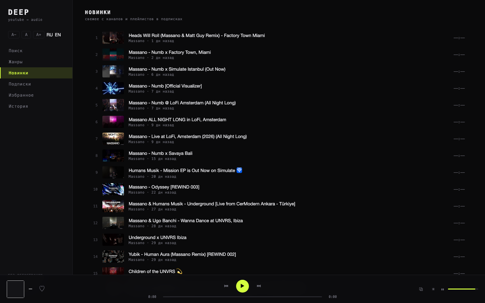
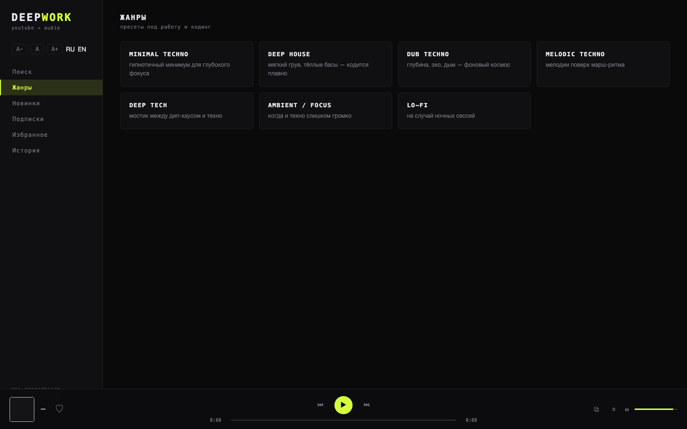

# deepwork — youtube → audio

[English](README.en.md) · Русский

Локальный аудио-плеер для YouTube: без регистрации, без скачивания файлов — только живая
звуковая дорожка. Заточен под музыку для работы и кодинга: minimal techno, deep house.




## Запуск

```bash
brew install yt-dlp        # единственная внешняя зависимость
node server.js             # → http://localhost:8787
```

Требуется Node ≥ 22.5 (встроенный `node:sqlite`). npm-зависимостей нет. Интерфейс и доки — RU/EN,
язык определяется автоматически по языку браузера (переключатель RU/EN в сайдбаре).

## Что умеет

- **Два движка звука.** Основной — стрим через yt-dlp (без рекламы). Если YouTube блокирует
  стрим (бот-проверка) — трек автоматически подхватывает **официальный скрытый YouTube-плеер**
  (IFrame API): играет всегда, как в браузере. Каждый новый трек снова пробует стрим первым.
- **Поиск** по YouTube без API-ключа
- **Жанры** — пресеты запросов: minimal techno, deep house, dub techno, melodic, ambient…
- **Подписки** без аккаунта — каналы (`@хендл`, ссылка, даже ссылка на видео) и плейлисты
- **Новинки** — агрегированная RSS-лента подписок
- **Плеер**: очередь из любого списка, перемотка (Range-прокси), shuffle, медиа-клавиши,
  визуализатор, масштаб интерфейса (A−/A+), избранное и история
- **Горячие клавиши**: `Space` — пауза, `←/→` — ±10 сек, `N/P` — трек назад/вперёд

## Приватность

- Ничего **не скачивается**: аудио течёт с YouTube в браузер «на лету»
- На диске только служебное: подписки, лайки, история — один SQLite-файл `data/mono.db`
- Сервер слушает только `127.0.0.1` — наружу API не торчит
- Интерфейс хранит настройки (язык, масштаб, громкость) в localStorage браузера

## Устойчивость к «бот-проверкам»

YouTube периодически флагает IP за автоматические запросы (ошибка
«Sign in to confirm you're not a bot»). Плеер переживает это несколькими слоями:

1. **Фолбэк на IFrame-плеер** — то же, что у людей в браузере: работает всегда, цена — иногда
   реклама в начале трека
2. **Куки браузера** — сервер сам находит куки Safari/Chrome/Firefox или файл `cookies.txt`
   (см. ниже) и стрим снова работает напрямую
3. **PO-токены** — интеграция с [bgutil-ytdlp-pot-provider](https://github.com/Brainicism/bgutil-ytdlp-pot-provider):
   локальный генератор токенов запускается автоматически, если собран в `~/bgutil-ytdlp-pot-provider`
4. **Гигиена запросов** — кэш резолвов на 2.5 ч, дедуп одновременных запросов, кулдаун 90 сек
   после ошибки

## Настройки (env)

| Переменная | По умолчанию | Что делает |
|---|---|---|
| `PORT` | `8787` | порт сервера |
| `YTDLP` | `yt-dlp` | путь к бинарнику yt-dlp |
| `MONO_COOKIES` | авто | `safari` / `chrome` / `firefox` / `edge` / `brave` или путь к `cookies.txt` |

Куки ищутся автоматически в таком порядке: `MONO_COOKIES` → `cookies.txt` в корне проекта
или в `data/` → профили браузеров (на macOS Safari требует Full Disk Access для терминала).
Проверка ленивая (60 сек) — доступ появился, заработало без перезапуска.
Текущее состояние: `curl localhost:8787/api/status` → поля `cookies` и `pot`.

## Структура

```
server.js        — HTTP-сервер: API, прокси аудио (Range), статика
lib/yt.js        — обёртка yt-dlp (поиск / списки / резолв) + кэши
lib/db.js        — SQLite: подписки, лайки, история
lib/cookies.js   — авто-поиск кук браузера / cookies.txt
public/          — фронтенд без сборки: index.html, app.js, style.css (RU/EN)
data/mono.db     — локальные данные (создаётся сам)
```

## Дисклеймер

Проект для **личного использования**. Контент остаётся на серверах YouTube и воспроизводится
их же плеером или временной ссылкой на аудиодорожку; ничего не хранится и не распространяется.
Соблюдайте Условия использования YouTube. Авторы не связаны с YouTube/Google.

## Лицензия

MIT — см. [LICENSE](LICENSE).
